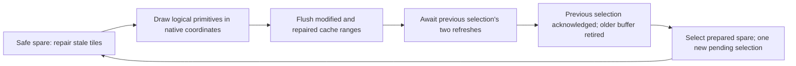

# M4.1 — realtime display transport qualification

This report records the real Guition board's presentation architecture,
component measurements, original16-voice + Delay audio workload, transitions,
long-run interaction and remaining limits. The panel initialization table,
DSI timings, RGB565 resolution, LDO3, resets/backlight, GT911 mapping, shared
I2C0 and audio/DSP implementations remain unchanged.

## Exact original pipeline audit

The M4 reference owns a PSRAM logical800×480 surface and two native480×800
scanout buffers. Drawing writes the logical surface through CPU cache.
`ppa_do_scale_rotate_mirror()` implicitly writes back its input extended
window and invalidates its output window, prepares preallocated descriptors,
then rotates270 degrees counterclockwise in blocking mode. For a full frame,
DMA logically reads768000 bytes and writes768000 bytes, in addition to CPU
drawing/cache writebacks and continuous DSI scanout. These are payload
calculations, not a hardware bus-counter measurement.

`esp_lcd_panel_draw_bitmap()` recognizes a pointer inside a native driver
framebuffer. It writes back the supplied native row range and selects that
buffer by `cur_fb_index`; it does not copy another full image in this branch.
The actual driver packaged with the platform is IDF commit`f56bea3d1f`.
Its DMA-completion ISR samples the selected index and restarts that DMA list;
the bridge VSYNC ISR independently invokes `on_refresh_done`. There is no
buffer identity or retirement acknowledgement in that public callback.

This corrects the M4 explanation based on the upstream v5.5 tag, which used
a DMA-completion callback in the inspected source. The pinned driver's
independent VSYNC/DMA ordering does **not** establish safe reuse after one
callback. Two refreshes are retained. A timeout faults the HAL, preventing
further rendering/reuse until teardown/reinitialization. Audio never waits
on the display fence.

Primary sources:
[pinned DPI driver](https://github.com/espressif/esp-idf/blob/f56bea3d1f/components/esp_lcd/dsi/esp_lcd_panel_dpi.c),
[pinned PPA SRM](https://github.com/espressif/esp-idf/blob/f56bea3d1f/components/esp_driver_ppa/src/ppa_srm.c),
[DPI API documentation](https://docs.espressif.com/projects/esp-idf/en/release-v5.5/esp32p4/api-reference/peripherals/lcd/dsi_lcd.html).

`GUITION_M41_AUDIT_SERIAL.log` measures the original M4 workloads before
transport optimization. All component times include task preemption; PPA
time includes its implicit cache work and blocking DMA wait, not only the
accelerator's arithmetic.

| Original mode/core | Draw avg/max us | PPA avg/max us | Submit avg/max us | Refresh wait avg/max us | Total avg/max us |
| --- | --- | --- | --- | --- | --- |
| LIGHT/core1 | 5708.57/26482 | 15494.26/15888 | 29.10/38 | 28665.44/29330 | 49915.11/68712 |
| HEAVY/core1 | 31183.51/52094 | 15467.51/15808 | 28.96/32 | 20178.98/31460 | 66876.78/99166 |
| LIGHT/core0 | 11733.58/59237 | 18308.41/21002 | 29.44/38 | 20744.14/34793 | 50958.27/93236 |
| HEAVY/core0 | 68698.73/112989 | 19299.73/21011 | 29.62/38 | 28890.19/30922 | 116934.00/162623 |

PPA, rasterization and fencing are significant costs; draw/swap submission
is negligible. Moving UI to another core still exposes the known memory
contention. Every M4.1 primary workload therefore uses audio core0 priority24,
UI core0 priority2 and touch core1 priority3.

## Alternatives and dirty cache work

The benchmark retains full logical/PPA presentation as reference and also
measures native drawing with full backbuffer reconstruction and native
drawing with bounded dirty-tile history. Logical rectangles are rasterized
directly into transformed native rectangles; lines, glyphs, circles and
touch feedback continue to accept800×480 logical coordinates.

The initial32×32 implementation retained zero render misses but achieved
only19.326 FPS in LIGHT. Its average backbuffer repair was9998.24 us and
cache synchronization9666.97 us. `GUITION_M41_INITIAL_SERIAL.log` preserves
this unsuccessful throughput experiment.

The next implementation uses16×16 tiles and coalesces adjacent tile runs
for each native row's memcpy. Cache synchronization is coalesced over each
dirty native tile band, including intervening clean address ranges. No
image pixels are copied through those gaps; clean cache lines need no
image writeback. `dirty_bytes`, `repair_bytes` and `cache_span_bytes` are
reported separately: cache address span is not a claim of exact external
bus traffic. There is no hidden full-frame PPA operation on the native path.

The hardware always scans a full native frame. The public DPI path can copy
a subregion into a framebuffer, but doing so into the currently scanned
buffer is not an anti-tearing partial presentation. The chosen dirty approach
updates only a safe backbuffer and still selects a complete coherent image.
All changed/repaired cache tiles are flushed before selecting it. A valid
one-row native-FB `draw_bitmap()` call selects that buffer after another
960-byte row cache range; it does not imply that only one row is displayed.
This depends on the pinned driver branch and must be re-audited on SDK upgrades.

## Framebuffer lifecycle and the third native buffer

Coalescing alone achieved28.656 FPS in LIGHT with zero render misses;
its average repair/draw/cache/wait times were5471.40/5207.43/1255.17/
22476.47 us. `GUITION_M41_COALESCED_COMPLETE_SERIAL.log` retains this
complete experiment. The remaining serialized fence limits preparation.

NativeQueued reserves three native framebuffers and removes the logical/PPA
surface. One buffer is the newest immutable selected scene, one is a safe
spare under CPU drawing, and the third is an older scanout candidate whose
retirement is protected by the previous selection's two-refresh fence.
There is at most one pending selection. Tile histories are fixed50-row
bitmasks, with30 native16×16 tiles per row, independently tracked for all
three buffers. Every commit marks changed tiles stale in the other two
buffers. Before drawing, the safe spare repairs only its stale tiles from
the newest immutable scene, which may still be pending scanout.



Example: driver starts on FB0. Prepare/select FB1, then prepare untouched
FB2 while FB1 is pending. Before selecting FB2, acknowledge FB1's two-refresh
fence; FB0 is now a safe spare. Prepare FB0 from immutable FB2, then wait for
FB2's fence before selecting FB0. FB1 is now safe. Rotation continues1→2→0.
No scanout/pending buffer is modified, no selection overwrites another pending
one, and dirty history carries changes missed across both intervening frames.
Drawing overlaps the fence; the fence itself is not shortened.

`present()` on NativeQueued acknowledges the previous image before selecting
the prepared image. `wait_idle()` drains the final pending selection and
defines the static/stop state. Display timeouts fault the HAL; drawing is
then refused until teardown. Double-buffer reference strategies remain
available. Switching back from queued to double buffering requires end/begin,
because a currently selected FB2 cannot be represented by a two-buffer model.

Completed-image counters advance only after two refreshes, separately from
submitted/rasterized-image counters. The audio controller samples completed
counts at the actual wall-clock window boundaries. FPS uses their difference,
not frame requests or submissions. It is a conservative acknowledgement of
presentation, not optical instrumentation. A final pending image drained
after a window is excluded from that window's FPS. At phase boundaries, a
pending previous-mode image may be acknowledged in the following window;
static mode can therefore report one completion while making no new changes.
Component averages use submitted frames because they measure preparation.

The native-only long run measures33551856→31247280 free PSRAM across display
initialization:2304576 bytes, comprising2304000 framebuffer payload plus576
runtime heap overhead. Internal free heap decreases by1536 bytes. Fixed tile
history masks are static internal data, separate from those heap deltas.
Payload equals M4's two native plus one logical buffers; the logical surface
is replaced by the third native surface. The strategy-comparison run also
reserves a logical/PPA reference surface (four surfaces total), and its
unused third native buffer is inert during the original double-buffer modes.

## Reproduction and evidence

Build/upload `guition_ui_audio_m41` with PlatformIO6.1.18 and the platform
already pinned in `platformio.ini`. The firmware accepts S for the short
strategy/transition run and L for the60-second NativeQueued run during a startup
selection window. The capture tool opens COM13, resets native USB/JTAG,
then sends the requested selection. Stop based on the final genuine marker,
not an assumed report duration:

```
python tests/capture_guition.py --output short.log --seconds 400 --command S --until "[MEM] M41 after audio shutdown "
python tests/capture_guition.py --output long.log --seconds 400 --command L --until "[MEM] M41 after audio shutdown "
python tests/analyze_m41.py short.log long.log
```

Timing storage and event arrays are bounded and allocated before measurement.
There are no per-frame/per-touch allocations, growing queues or serial reports
from realtime tasks. Full reports are emitted only after audio has stopped.
An early110-second coalesced capture ended during phase4's report; it is
preserved as `GUITION_M41_COALESCED_SERIAL.log` and is not used to claim a
complete qualification. Its replacement waits for the final marker.

## Workload, timing and transition interpretation

Audio remains the original16 voices, MIDI48–63/waves0–15, pan -120 in steps
of16, envelope3, length127, modulation64, voice volume80, detune0, master60,
filter0. Original Delay remains88200 samples, time12000, feedback120,
input160, return100, mask0xffff. Sample rate is44100 Hz, stereo block size256
and render budget5804.988662 us. Short phases retrigger the same notes at
their boundaries. The long run retriggers every517 blocks, before the
unchanged five-second envelopes expire; it does not replace envelopes or
reduce voice/FX work. Delay history stays live throughout each run.

LIGHT updates BPM/step/parameter text, eight small meters, old/new playhead
positions and two pad highlights. Most pixels are unchanged. The old touch
cursor's region is reconstructed from the static background using a clipped
draw before dynamic widgets and the new cursor are drawn. Corner labels,
bars, axes and borders therefore recover correctly even when touched.
HEAVY is full fill/stripes/text, requested10 FPS; it is a stress mode whose
throughput may be throttled. No resolution or RGB565 format is reduced.

All short windows contain517 original render timings, with active voice
counts checked before/after every block. Transitions request a mode/page
change at block100, recording whether UI work was in progress. The separate
transition table checks blocks80–179, and the full window includes all
earlier/later spikes. First-frame setup, page reconstruction and spillover
are not removed as warmup. The UI observes transitions only after finishing
the current preparation/presentation; static explicitly drains pending work.

The long run contains10336 blocks (60.000363 seconds of generated samples).
Wall-clock duration is slightly shorter because transport already runs and
DMA queue occupancy changes at the boundary. Render percentiles are nearest
rank; means and deadline misses are recomputed from the ordered raw capture.
UI FPS uses actual wall time and acknowledged completions. The initial
page, periodic full redraw every150 UI submissions and frame skips remain
in the long-run measurements. Frequency of those pages follows achieved
frame cadence rather than an independent timer.

`GUITION_M41_LONG_SERIAL.log` is the first60-second run with no human touch
packets:29.541 acknowledged FPS,1772 completions/1773 submissions/26 skips,
zero render misses, p99=3984 us, max=4011 us and30.90% worst reserve. Both
heaps and largest free block stay unchanged. Touch polling runs100.010 Hz,
but this run does **not** qualify physical touch under load.

The M3.2 reference is p99=2898/max=3592 us; M4 core0 LIGHT is
p99=3767/max=3776 us at19.993 FPS. These historical comparisons involve
different firmware layouts and interrupt placement; deltas do not prove
isolated causal costs. M4.1 also reports its own STATIC baseline and
per-component measurements. Display initialization now runs on core0 and
the observed task cores and refresh cadence are included in the final logs.

The serial `result=PASS` covers measured PCM, render/transport API checks,
display/touch API errors and stable heaps. FPS acceptance, human picture
verification, physical touch coverage, audible output and DMA starvation
are separate. No reliable public audio-starvation counter is claimed.

## Final qualification and limits

The repeated 60-second run is `GUITION_M41_INTERACTION_SERIAL.log`, using
firmware SHA256 `1D7607AF36F19D241D60BC734CD6962EE6AA4E34ACBB486DA04E0F6C536A7820`.
It records 10336 blocks, 16 voices throughout, original Delay, zero render
misses, zero transport/UI/touch errors, zero silent blocks and zero rail frames.
Render p99/max are 4005/4046 us: 1758.989 us (30.30%) worst reserve.
Acknowledged throughput is **29.474 FPS**, 1768 completed/1769 submitted,
30 skipped deadlines, including 12 full page constructions. The measured
refresh callback rate is 60.466 Hz. Two-refresh retirement caps selection
cadence near 30.233 FPS even before preparation costs. Full page preparation
peaks at 122380 us; these page costs explain additional skips. Short cold
LIGHT achieves 28.323 FPS, including its initial page. Neither figure is
reported as guaranteed constant 30 FPS. The demonstrated sustainable rate
for this complete workload with interaction and pages is 29.474 FPS.

Touch records 5999 polls at 100.010 Hz, 221 presses, 221 releases and 1889
movements. Coverage mask31 proves all four corners and center were sampled;
2331 audio blocks observe changed touch activity, with zero misses. Every
retained event's native/logical mapping is validated. The fixed trace holds
512 events and discards 302 later trace entries; aggregate counters and
coverage continue updating. This is bounded diagnostic trace truncation,
not a claim that every physical movement was retained. The user confirmed
correct image and cursor tracking without visual faults during this run.

PSRAM/internal free heap and largest free block are identical before/after
measurement, with all workers and allocations still live. The native display
payload is 2304000 bytes, with measured display heap deltas 2304576 PSRAM and
1536 internal bytes. Long capture storage is 41344 bytes of fixed timing
payload, plus bounded event storage and task/allocator overhead. Post-shutdown
snapshots are reported separately and are not used to infer measurement leaks.

**Safe enough to begin the real 800×480 drum-machine UI: yes, within the
measured design envelope.** Keep low-priority rendering on core0, bounded
logical dirty drawing, three immutable/retired native buffers and the existing
audio priorities. Treat page changes as work that can skip visual frames.
This qualifies the pipeline and realistic measured workload, not arbitrary
future UI complexity. More widgets, larger dirty areas, asset decoding and
SDK changes require renewed coexistence measurements. Audible output and
reliable DMA starvation accounting remain unverified; render/API/PCM results
alone do not prove those. No SD or full application UI work was started.

Implementation commits: `71e1631` (native dirty audit/diagnostic), `4a71ec1`
(coalesced tile repair/cache), `89bb050` (three-buffer overlap and retirement).
Hosted CI for `89bb050` passed all seven environments and PCM, FX safety,
original FX equivalence, geometry, dirty history and M4 capture validation:
https://github.com/ovelhaaa/P4SDM/actions/runs/37404573305 . The final evidence
commit adds M4.1 raw-capture and physical-interaction validation to that CI.

Files changed: `src/hal/display_hal.{h,cpp}`, `src/hal/display_dirty.h`,
`src/display_diagnostic.cpp`, `src/synth_diagnostic.cpp`,
`src/diagnostics/{ui_audio_diagnostic,display_pipeline_diagnostic}.h`,
`platformio.ini`, `tests/{display_dirty_test.cpp,capture_guition.py,analyze_m41.py}`,
`.github/workflows/guition.yml`, this report, `docs/VALIDATION.md` and the
preserved `GUITION_M41_*_SERIAL.log` captures.

## Recomputed final measurements

The tables below are generated from the final short comparison and genuine
interaction long run by `tests/analyze_m41.py --require-interaction`.
All 19125 ordered render timings, percentiles, heap comparisons, transition
ranges and retained touch coordinate mappings are checked against raw data.
The short comparison reserves four surfaces to keep the PPA reference; the
long native run reserves three. Historical M3.2 deltas are descriptive only.

| Phase | Blocks | Min/mean us | p50/p95/p99 us | Max us | Misses | p99/max delta M3.2 us | Worst reserve | Result |
| --- | --- | --- | --- | --- | --- | --- | --- | --- |
| PPA_STATIC | 517 | 3092/3155.80 | 3154/3167/3172 | 3913 | 0 | 274/321 | 32.59% | SAFE |
| PPA_LIGHT | 517 | 3117/3262.18 | 3168/3873/3914 | 3961 | 0 | 1016/369 | 31.77% | SAFE |
| PPA_HEAVY | 517 | 3130/3664.26 | 3868/3963/4007 | 4023 | 0 | 1109/431 | 30.70% | SAFE |
| NATIVE_FULL_STATIC | 517 | 3100/3154.47 | 3154/3168/3171 | 3175 | 0 | 273/-417 | 45.31% | SAFE |
| NATIVE_FULL_LIGHT | 517 | 3115/3675.64 | 3924/3974/3985 | 3999 | 0 | 1087/407 | 31.11% | SAFE |
| NATIVE_FULL_HEAVY | 517 | 3138/3829.05 | 3934/3989/4000 | 4020 | 0 | 1102/428 | 30.75% | SAFE |
| DIRTY_STATIC | 517 | 3139/3169.59 | 3154/3170/3919 | 3977 | 0 | 1021/385 | 31.49% | SAFE |
| DIRTY_LIGHT | 517 | 3113/3401.91 | 3179/3976/3991 | 3998 | 0 | 1093/406 | 31.13% | SAFE |
| DIRTY_HEAVY | 517 | 3105/3832.25 | 3935/3994/4005 | 4031 | 0 | 1107/439 | 30.56% | SAFE |
| QUEUED_STATIC | 517 | 3102/3154.70 | 3155/3168/3173 | 3181 | 0 | 275/-411 | 45.20% | SAFE |
| QUEUED_LIGHT | 517 | 3108/3422.07 | 3179/3963/3982 | 4000 | 0 | 1084/408 | 31.09% | SAFE |
| QUEUED_HEAVY | 517 | 3119/3941.18 | 3943/3999/4018 | 4027 | 0 | 1120/435 | 30.63% | SAFE |
| STATIC_TO_LIGHT | 517 | 3145/3398.28 | 3172/3968/3989 | 4003 | 0 | 1091/411 | 31.04% | SAFE |
| LIGHT_TO_STATIC | 517 | 3122/3234.49 | 3156/3929/3974 | 3995 | 0 | 1076/403 | 31.18% | SAFE |
| LIGHT_TO_HEAVY | 517 | 3125/3871.67 | 3938/3998/4013 | 4025 | 0 | 1115/433 | 30.66% | SAFE |
| HEAVY_TO_LIGHT | 517 | 3148/3548.48 | 3486/3981/3997 | 4010 | 0 | 1099/418 | 30.92% | SAFE |
| PAGE_TO_LIGHT | 517 | 3109/3449.05 | 3189/3967/3987 | 3997 | 0 | 1089/405 | 31.15% | SAFE |
| LONG_LIGHT | 10336 | 3091/3415.79 | 3216/3974/4005 | 4046 | 0 | 1107/454 | 30.30% | SAFE |

| Phase | Requested/acknowledged FPS | Completed/submitted/skips | Draw avg/max us | Repair avg/max us | PPA avg/max us | Cache avg/max us | Submit avg/max us | Wait avg/max us | Total avg/max us |
| --- | --- | --- | --- | --- | --- | --- | --- | --- | --- |
| PPA_STATIC | 0/0.000 | 0/0/0 | 0.00/0 | 0.00/0 | 0.00/0 | 0.00/0 | 0.00/0 | 0.00/0 | 0.00/0 |
| PPA_LIGHT | 30/19.659 | 59/60/31 | 3552.78/66008 | 15.37/22 | 16585.77/21152 | 0.00/0 | 30.55/38 | 30440.52/34766 | 50708.43/116710 |
| PPA_HEAVY | 10/8.330 | 25/25/4 | 79775.24/144503 | 13.88/18 | 16992.88/21449 | 0.00/0 | 30.64/34 | 21547.68/23158 | 118390.24/183335 |
| NATIVE_FULL_STATIC | 0/0.333 | 1/0/0 | 0.00/0 | 0.00/0 | 0.00/0 | 0.00/0 | 0.00/0 | 0.00/0 | 0.00/0 |
| NATIVE_FULL_LIGHT | 30/11.662 | 35/36/55 | 7207.83/69394 | 48434.78/51570 | 0.00/0 | 802.11/4207 | 126.44/3580 | 27547.28/28901 | 84270.25/145071 |
| NATIVE_FULL_HEAVY | 10/5.998 | 18/18/12 | 95630.11/156420 | 48110.56/51657 | 0.00/0 | 1272.67/4692 | 27.44/30 | 23665.33/27493 | 169174.39/231509 |
| DIRTY_STATIC | 0/0.333 | 1/0/0 | 0.00/0 | 0.00/0 | 0.00/0 | 0.00/0 | 0.00/0 | 0.00/0 | 0.00/0 |
| DIRTY_LIGHT | 30/28.323 | 85/86/4 | 5150.88/69272 | 5467.06/48305 | 0.00/0 | 1305.05/4321 | 110.81/3599 | 22552.17/27083 | 34848.56/139273 |
| DIRTY_HEAVY | 10/5.998 | 18/18/12 | 94467.44/152315 | 46619.00/52028 | 0.00/0 | 2165.00/4711 | 27.67/34 | 23513.89/33749 | 167055.22/197298 |
| QUEUED_STATIC | 0/0.333 | 1/0/0 | 0.00/0 | 0.00/0 | 0.00/0 | 0.00/0 | 0.00/0 | 0.00/0 | 0.00/0 |
| QUEUED_LIGHT | 30/28.323 | 85/86/4 | 3727.79/69303 | 7748.88/52177 | 0.00/0 | 2068.57/4349 | 106.57/3554 | 7681.51/20668 | 21641.78/118290 |
| QUEUED_HEAVY | 10/6.664 | 20/21/9 | 91977.00/152144 | 50069.57/52526 | 0.00/0 | 3871.05/4716 | 28.62/44 | 4.48/5 | 146007.95/163545 |
| STATIC_TO_LIGHT | 0/23.325 | 70/69/19 | 4246.71/69373 | 7670.80/52094 | 0.00/0 | 2144.33/4303 | 28.93/36 | 19637.30/26634 | 34145.00/118560 |
| LIGHT_TO_STATIC | 30/5.331 | 16/15/2 | 8219.80/69693 | 11758.27/52211 | 0.00/0 | 1501.00/4342 | 28.47/35 | 17128.87/26603 | 39172.13/77029 |
| LIGHT_TO_HEAVY | 30/9.996 | 30/32/9 | 51192.84/92676 | 31816.69/52583 | 0.00/0 | 2670.50/4749 | 28.66/42 | 7911.97/26650 | 93804.34/145557 |
| HEAVY_TO_LIGHT | 10/23.658 | 71/71/7 | 10618.25/156792 | 9791.61/52342 | 0.00/0 | 2007.49/4460 | 28.51/36 | 19652.69/26662 | 42257.54/209717 |
| PAGE_TO_LIGHT | 30/28.656 | 86/85/5 | 4609.04/69496 | 8189.91/52433 | 0.00/0 | 2179.94/4577 | 108.32/3629 | 6361.38/26688 | 21757.73/80348 |
| LONG_LIGHT | 30/29.474 | 1768/1769/30 | 5463.02/74439 | 6949.61/52834 | 0.00/0 | 1527.31/4607 | 51.68/3660 | 10994.31/26672 | 25158.96/122380 |

| Phase | Dirty/repair bytes avg | Peak L/R | Nonzero/silent/rail | Write errors/timeouts | UI/touch errors | Touch Hz | Press/release/drag | Audio activity blocks/misses |
| --- | --- | --- | --- | --- | --- | --- | --- | --- |
| PPA_STATIC | 0.00/0.00 | 4725/6074 | 132278/0/0 | 0/0 | 0/0 | 100.171 | 0/0/0 | 0/0 |
| PPA_LIGHT | 768000.00/0.00 | 4757/6035 | 132288/0/0 | 0/0 | 0/0 | 99.963 | 0/0/0 | 0/0 |
| PPA_HEAVY | 768000.00/0.00 | 4757/6035 | 132287/0/0 | 0/0 | 0/0 | 99.965 | 0/0/0 | 0/0 |
| NATIVE_FULL_STATIC | 0.00/0.00 | 4757/6035 | 132287/0/0 | 0/0 | 0/0 | 99.964 | 0/0/0 | 0/0 |
| NATIVE_FULL_LIGHT | 133162.67/768000.00 | 4757/6035 | 132287/0/0 | 0/0 | 0/0 | 99.963 | 0/0/0 | 0/0 |
| NATIVE_FULL_HEAVY | 768000.00/768000.00 | 4757/6035 | 132287/0/0 | 0/0 | 0/0 | 100.298 | 0/0/0 | 0/0 |
| DIRTY_STATIC | 0.00/0.00 | 4757/6035 | 132287/0/0 | 0/0 | 0/0 | 99.965 | 0/0/0 | 0/0 |
| DIRTY_LIGHT | 122624.00/130220.65 | 4757/6035 | 132287/0/0 | 0/0 | 0/0 | 99.964 | 0/0/0 | 0/0 |
| DIRTY_HEAVY | 768000.00/731704.89 | 4757/6035 | 132287/0/0 | 0/0 | 0/0 | 99.964 | 0/0/0 | 0/0 |
| QUEUED_STATIC | 0.00/0.00 | 4757/6035 | 132287/0/0 | 0/0 | 0/0 | 99.964 | 0/0/0 | 0/0 |
| QUEUED_LIGHT | 122624.00/140645.21 | 4757/6035 | 132287/0/0 | 0/0 | 0/0 | 99.964 | 0/0/0 | 0/0 |
| QUEUED_HEAVY | 768000.00/737036.19 | 4757/6035 | 132287/0/0 | 0/0 | 0/0 | 99.963 | 0/0/0 | 0/0 |
| STATIC_TO_LIGHT | 124490.20/146216.81 | 4757/6035 | 132287/0/0 | 0/0 | 0/0 | 99.965 | 0/0/0 | 0/0 |
| LIGHT_TO_STATIC | 158549.33/204561.07 | 4757/6035 | 132287/0/0 | 0/0 | 0/0 | 99.964 | 0/0/0 | 0/0 |
| LIGHT_TO_HEAVY | 482320.00/483600.00 | 4757/6035 | 132287/0/0 | 0/0 | 0/0 | 100.296 | 0/0/0 | 0/0 |
| HEAVY_TO_LIGHT | 161034.82/182062.87 | 4757/6035 | 132287/0/0 | 0/0 | 0/0 | 99.965 | 0/0/0 | 0/0 |
| PAGE_TO_LIGHT | 130397.36/148582.40 | 4757/6035 | 132287/0/0 | 0/0 | 0/0 | 99.964 | 0/0/0 | 0/0 |
| LONG_LIGHT | 121451.96/129957.99 | 4757/6074 | 2644708/0/0 | 0/0 | 0/0 | 100.010 | 221/221/1889 | 2331/0 |

| Transition | Request block | In flight | Max around transition us | Misses blocks80–179 | Idle observations |
| --- | --- | --- | --- | --- | --- |
| STATIC_TO_LIGHT | 100 | 0 | 3988 | 0 | 303 |
| LIGHT_TO_STATIC | 100 | 1 | 3989 | 0 | 1459 |
| LIGHT_TO_HEAVY | 100 | 1 | 4025 | 0 | 0 |
| HEAVY_TO_LIGHT | 100 | 1 | 4010 | 0 | 0 |
| PAGE_TO_LIGHT | 100 | 1 | 3994 | 0 | 0 |

| Phase | PSRAM before/after | Largest before/after | Internal before/after |
| --- | --- | --- | --- |
| PPA_STATIC | 30080968/30080968 | 29884404/29884404 | 505556/505556 |
| PPA_LIGHT | 30080968/30080968 | 29884404/29884404 | 505556/505556 |
| PPA_HEAVY | 30080968/30080968 | 29884404/29884404 | 505556/505556 |
| NATIVE_FULL_STATIC | 30080968/30080968 | 29884404/29884404 | 505556/505556 |
| NATIVE_FULL_LIGHT | 30080968/30080968 | 29884404/29884404 | 505556/505556 |
| NATIVE_FULL_HEAVY | 30080968/30080968 | 29884404/29884404 | 505556/505556 |
| DIRTY_STATIC | 30080968/30080968 | 29884404/29884404 | 505556/505556 |
| DIRTY_LIGHT | 30080968/30080968 | 29884404/29884404 | 505556/505556 |
| DIRTY_HEAVY | 30080968/30080968 | 29884404/29884404 | 505556/505556 |
| QUEUED_STATIC | 30080968/30080968 | 29884404/29884404 | 505556/505556 |
| QUEUED_LIGHT | 30080968/30080968 | 29884404/29884404 | 505556/505556 |
| QUEUED_HEAVY | 30080968/30080968 | 29884404/29884404 | 505556/505556 |
| STATIC_TO_LIGHT | 30080968/30080968 | 29884404/29884404 | 505556/505556 |
| LIGHT_TO_STATIC | 30080968/30080968 | 29884404/29884404 | 505556/505556 |
| LIGHT_TO_HEAVY | 30080968/30080968 | 29884404/29884404 | 505556/505556 |
| HEAVY_TO_LIGHT | 30080968/30080968 | 29884404/29884404 | 505556/505556 |
| PAGE_TO_LIGHT | 30080968/30080968 | 29884404/29884404 | 505556/505556 |
| LONG_LIGHT | 30843520/30843520 | 30408692/30408692 | 505856/505856 |

