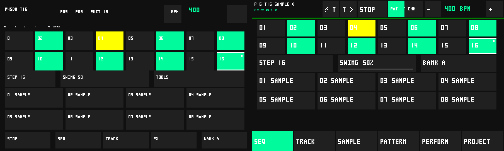
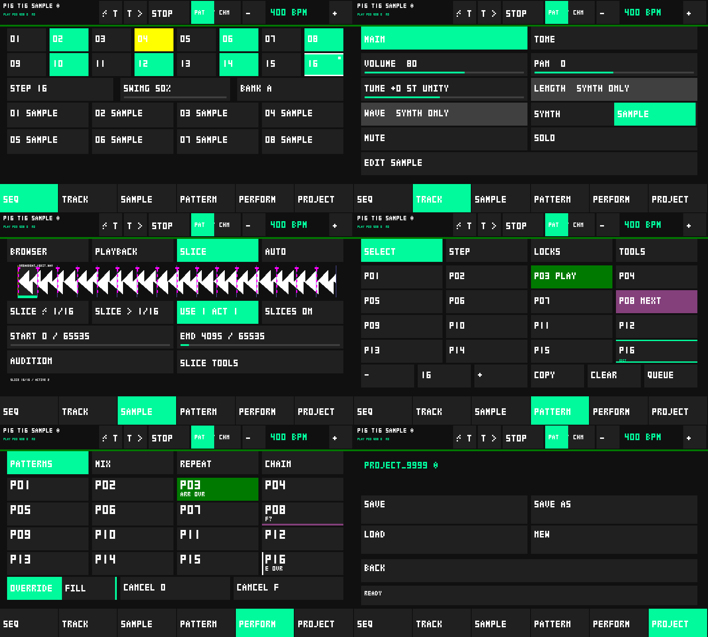

# M20 — touchscreen UI architecture rebuild

Implementation starts from accepted `main` commit `66fff46`. The initial audit is
in [M20_UI_AUDIT.md](M20_UI_AUDIT.md). M20 changes UI presentation, navigation,
geometry, text, and qualification code. It does not add DSP/sequencer features.

## Navigation before and after

Previously SEQ/TRACK/FX formed the footer. FX led to Project, Chain, and
Performance. Track led to Sample and Tone; Sample led to Playback, then Slice,
then Transients. Sequence led separately to Pattern, Step, Tools, and the
Basic → Tone → Sample lock paging chain. Page-dependent Back buttons retraced
those paths.

The persistent footer now exposes **SEQ / TRACK / SAMPLE / PATTERN / PERFORM /
PROJECT** from every editor. Selected Track, Pattern, Step, inspected slice,
and musical transport context survive navigation. Pending destructive UI
intents are cancelled on navigation. Audio-owned Repeat and audition release
owners remain independent of navigation.

| Section | Views / capabilities |
|---|---|
| SEQ | 16 steps, eight Track pads with A/B bank, Step shortcut, Swing; persistent transport/BPM/Track selection |
| TRACK | Main: source, Volume, Pan, Pitch/Tune, Length, Wave, Mute, Solo, Edit Sample. Tone: Cutoff, Resonance, Delay Send, global Delay |
| SAMPLE | Browser, Playback, Slice, Auto; Slice Tools discloses equal divide, Add/Delete/Reset without crowding the waveform |
| PATTERN | Select, Step, Locks, Tools; Locks categories Basic/Tone/Sample; Tools categories Track/Generate/Pattern |
| PERFORM | Patterns, Mix, Repeat, Chain; Mix reuses the Performance page with a distinct tab/state |
| PROJECT | Save, Save As, Load, New, name/dirty state; Browser/Naming/Confirm remain captured workflows |

FX has no production navigation entry. Its enum value/legacy numeric routes
remain a compatibility adapter for prior host/qualification scripts; its layout
aliases Track/Tone. The registry has 19 records, including this compatibility
view and the additional Slice Tools view. No engine feature was removed.

## Layout and visual system

All coordinates are logical 800×480 landscape pixels with exclusive right/bottom
edges. Status is y0–55; content is y56–415; navigation is y416–479. Subtabs use
y60–111. Diagnostics reserve y56–59 explicitly and never overwrite a status or
control. Actionable rectangles are at least 52 px wide and high, including Chain
rows/editor buttons. Chain shows five rows with existing scrolling.

The header separates context, Track previous/next, transport, Pattern/Chain mode,
and BPM controls. Sample-only editors display a disabled state on Synth Tracks;
Browser remains available for assigning a sample. Length/Wave and Wave locks
are visibly disabled for sample sources. Apply requires a Ready proposal owned
by the selected Track.

`src/app/ui_layout.h` defines background, surface, primary, secondary, warning,
danger, disabled, text, muted, current, queued, boundary, and proposal RGB565
tokens. Current/queued/editing pads use separate fill/border/badge semantics.
Waveform selection uses the warning token, active slice uses primary, canonical
boundaries use boundary, and proposals use dashed proposal markers.

The original 3×5 font retains fixed four-column advance. Main control labels
are scale 3 (15 px glyph height), compact status is scale 1–2, values/pads use
larger roles, and Repeat numerals are scale 8. Signs, punctuation, and lowercase
letters now render instead of occupying blank character cells. Fixed-buffer
truncation and renderer clipping bound every widget. No graphics stack was
replaced. Continuous parameters have a common filled slider rail; discrete
choices use selected/disabled segmented targets.

Destructive slice operations, region reset, Chain deletion, and clearing locks
capture a confirmation intent, including target and generation. Existing
Pattern/Tools/Project confirmations remain. Destructive confirmation targets
use the danger role. Notifications share a fixed buffer and expire after 4.5 s;
queue-full and storage/project messages cannot overwrite the main context.

## Architecture and preservation

An immutable page-local widget registry owns drawing, visibility, touch, and
drag geometry. Strongly grouped enums name navigation and major controls; IDs
below 222 adapt the accepted command handlers. Each control draw scopes the
existing renderer clip to its rectangle. There is no separately duplicated
production hit-test coordinate table.

The production renderer has six section entry points and draws only registry
members. Dirty rendering uses the same registry instead of 26 handwritten page
predicates. Direct `app::widget` call sites fall from 9 to 2 (both remaining calls
are old qualification scripts), `app::hit` from 2 to 0, and `app::drag` from 8 to
0. Thus 17 direct global geometry/hit/drag assumptions and 26 visibility
predicates were removed from production callers. Legacy behavioral numeric
ranges remain; this milestone does not pretend to have rewritten every handler.

The registry is initialized into fixed immutable tables before task startup.
It returns references rather than stack copies. This corrects an initial device
stack overflow found during qualification; the task stack size is unchanged.
No per-frame allocation is introduced. Context invalidation covers Track,
source, sample replacement, Pattern edits, and Project revision changes.
Continuous controls keep dirty redraws; playhead, flash pads, and arrangement
status continue to dirty their affected widgets.

Engine/command source before `Rect`, the detector, sample types, voice routing,
and Project codec are identical to accepted main. Actual baseline event/RNG,
Repeat, eight-lock and byte comparisons cover 7.2 million samples. Engine stays
52,616 bytes, Ui stays 116 bytes, and Project stays **V2 / 52,704 bytes** with
identical encoded bytes. Command queue, explicit Track/Pattern/Step targeting,
audio ownership, Project locking, transient request identity, and physical
Repeat/audition release recovery remain intact.

## Host evidence

* Layout: 19 records, 494 registered widgets, **zero overlaps**.
* Touch: **2,904 edge checks**, including corner pixels and points just outside
  each edge; minimum actionable dimension 52 px.
  Segmented choices additionally verify each cell's boundaries and >=52 px size.
* Text: registry labels plus representative dynamic extremes, scales 1–4,
  maximum Track/Pattern/BPM/Choke/Slice/Chain/lock/project/error strings; bounded
  text cannot escape its rectangle.
* Navigation: all six sections from every record, every subtab, category state,
  retained context, unsupported sample locks, captured confirmation invalidation,
  Project modal cancellation, and notification expiry/wraparound.
* Dirty model: isolated Volume rectangle **49,152 bytes**, two step rectangles
  **24,576 bytes**, versus 768,000 for the full screen.
* Host rendering: actual firmware drawing functions and actual font code with
  fixed storage/model fixtures, including Mix, Generate, Pattern Tools, Project
  confirmation, and disabled Sample context; **zero render allocations**.

Reproduce with `python tests/run_host_checks.py`, `python tests/render_ui.py`,
and `python tests/render_ui.py --baseline`. PPM/PNG evidence is local under
`.pio/m20-before` and `.pio/m20-after`; no large image binaries are committed.
These are host framebuffer renders, not photographs of the physical screen.
The small PNG evidence is retained in the repository:

## Device evidence and performance

Final binaries were uploaded to the connected JC4880P4 on COM13. Two genuine
80-second, 13,782-block captures passed `analyze_m20.py` and every inherited
M19/M18.1/M18/M17/M15/M14/M13/M12/M11/M10/M9/M8/M5 assertion. Both included the
existing dense 16-voice workload, locks, tone, Delay, Chain, Performance, Repeat,
and transient qualification rather than an idle demo.

| Audio timing (microseconds) | SAMPLE | SYNTH |
|---|---:|---:|
| p50 | 2,940 | 3,738 |
| p95 | 3,378 | 4,113 |
| p99 | 3,498 | 4,226 |
| Maximum | 4,118 | 4,490 |
| Worst-case headroom against 256/44,100 s | **29.1%** | **22.7%** |
| Deadline misses / I2S failures / timeouts / rails | 0 / 0 / 0 / 0 | 0 / 0 / 0 / 0 |

| UI measurement | SAMPLE | SYNTH |
|---|---:|---:|
| Slider preparation maximum | 42,125 us | 58,983 us |
| Slider dirty bytes | 49,152 | 49,152 |
| Two-step/playhead preparation maximum | 44,341 us | 54,254 us |
| Two-step dirty bytes | 24,576 | 24,576 |
| Maximum UI loop interval during qualification | 137,310 us | 177,345 us |

Full-page timings include preparation/drawing before present; dirty bytes measure
the existing tiled transfer mask. They do not claim LCD scanout latency or a
finger-response percentile. Each of the 19 page records was rendered; every full
page used 768,000 bytes. Page-specific maxima are retained in the raw captures.

| Full-page preparation maximum (us) | SAMPLE | SYNTH |
|---|---:|---:|
| SEQ | 108,377 | 146,890 |
| TRACK main | 126,092 | 160,283 |
| SAMPLE Slice | 126,547 | 152,705 |
| PATTERN Select | 118,470 | 158,398 |
| PERFORM Patterns | 122,083 | 163,762 |
| PROJECT | 111,014 | 146,811 |

SAMPLE PSRAM stayed 24,265,252 bytes and internal heap 217,852 bytes; SYNTH PSRAM
stayed 26,427,944 and internal heap 242,780. Largest allocations also remained
identical before/after. Both runs mounted the physical card at 4-bit / 20 MHz and
indexed nine files. No allocation during host frame rendering was detected.

Evidence: [SAMPLE serial](GUITION_M20_SAMPLE_STRESS_SERIAL.log),
[SYNTH serial](GUITION_M20_SYNTH_STRESS_SERIAL.log).
Normal `guition_app` was subsequently uploaded and its
[startup capture](GUITION_M20_NORMAL_SERIAL.log) confirms audio/SD initialization;
this short capture is not a replacement for the touch/listening walkthrough.

An explicit physical-card mode in the M13 analyzer verifies mounted 4-bit,
20 MHz SD and a nonempty index instead of requiring the historical `NO CARD`
string. Default historical checks are unchanged. All inherited audio, workload,
heap, coverage, and ownership assertions remain enabled by M20 analysis.

## Physical walkthrough and workflows

Local CI host/analyzer checks: **81/81 PASS**, including all retained prior checks,
the layout/navigation/text/hit tests, exact V2/equivalence regression, actual
renderer/allocation checks, physical SD regression evidence, and both final M20
device log analyzers. The existing GitHub workflow retains the prior firmware
matrix and adds both M20 builds and analyzers. These are local results; a remote
GitHub Actions run has not been triggered by a push.
Firmware compilation: **25/25 configurations PASS on the final source** (22
retained diagnostics/historical stress variants plus normal application and the
two M20 stress variants). `git diff --check` is clean. Changes remain local and
uncommitted on `main`; no subsequent DSP milestone has been started.

Finger-touch inspection, photographs, listening, and interactive SD load/save
have not been observed through serial. A connected card/index and scripted
device stress do **not** qualify these requirements. The normal application
firmware has been restored on the device for the following acceptance pass.

| Workflow | Navigation overhead, excluding the musical edits | Physical result |
|---|---|---|
| A: build a beat | From SEQ: Step shortcut 1, return SEQ 1; Step/Probability controls directly available | Pending |
| B: load/chop | Sample 1; Playback/Slice/Auto each 1; return SEQ 1; Slice Tools is one extra contextual tap | Pending |
| C: locks | Pattern 1, Locks 1; Basic/Tone/Sample each 1. Selected Step is retained; Step shortcut then Locks is also direct | Pending |
| D: performance | Perform 1; Mix/Repeat/Chain each 1; Fill is the visible Patterns modifier | Pending |
| E: save | Project 1; Save As control 1; generated-name controls and confirmation; Load directly from Project Home | Pending |

The structural counts above are derived from the navigation state machine,
not stopwatch measurements or completed physical workflows. Every common
section/subpage/control follows the 1/2/3 tap target except deliberate modal
confirmation and the disclosed Slice Tools workflow.

Walk each of the six sections, operate its controls, change Track/Pattern/source,
inspect clipping/overwrites/stale pixels, test hold/release on Repeat and audition,
browse/load `/P4SDM/SAMPLES`, analyze/apply transients, and save/load Project V2.
Capture SEQ, TRACK, SAMPLE/SLICE, PATTERN/LOCKS, PERFORM, and PROJECT evidence.

## Remaining issues / acceptance answer

The physical walkthrough and A–E touch workflows are mandatory outstanding
acceptance items. The parameter font is still the original compact pixel font;
long dynamic filenames/statuses are intentionally truncated. Numeric command
adapters remain in behavioral handlers, although production geometry and
navigation no longer depend on the global table. M20 does not tune the detector,
add interpolation, or begin another milestone.

**Does P4SDM now present its existing capabilities as one coherent touchscreen
groovebox UI, with clear navigation and no observed control/text overwrites,
while preserving all accepted realtime and project behavior?**

The implementation and host evidence support coherent navigation and bounded,
non-overlapping controls/text. Both final device stress runs preserve the
required >=20% realtime headroom; Engine and V2 regression checks pass. Physical no-overwrite,
touch usability, and SD workflows remain **unqualified until the walkthrough**;
M20 cannot be declared fully accepted on serial/host evidence alone.
